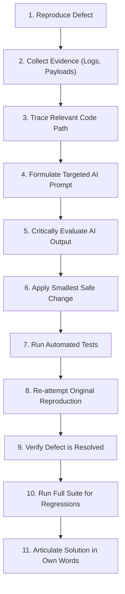

# AI-Assisted Debugging Guide: Professional Practices & Methodology

## Overview

Modern software engineering increasingly leverages AI coding assistants (such as ChatGPT, Gemini, Claude, GitHub Copilot, and Antigravity) to accelerate development and problem-solving. However, using AI effectively requires **critical thinking, disciplined scientific debugging methodology, and rigorous verification**.

Blindly copying code generated by AI without understanding the root cause introduces regressions, security vulnerabilities, and technical debt. This guide teaches the industry-standard process for AI-assisted debugging.

---

## The 11-Step AI Debugging Process



### 1. Reproduce the Bug Consistently
Never attempt to debug a problem you cannot reliably trigger. Establish an exact, step-by-step sequence of user actions or HTTP requests that exhibits the defect every single time.

### 2. Collect Concrete Evidence
Before opening an AI tool, gather objective data:
- HTTP request URL, method, headers, and payload.
- HTTP response status code and JSON error body.
- Backend server console logs, exception stack traces, and SQL queries.
- Browser DevTools Console errors and Network timing waterfalls.

### 3. Trace and Understand Relevant Code
Locate the specific classes, methods, or UI components involved in the failing flow. Form a preliminary hypothesis: Is this an authentication issue, a database query constraint, a state management flaw, or an off-by-one boundary condition?

### 4. Ask Targeted, Context-Rich Questions
Provide the AI with **focused context**, not an entire repository dump. State what you observed, what you expected, the relevant code snippet, and what you need the AI to analyze.

### 5. Critically Review AI Suggestions
Do not assume AI code is correct. AI models frequently:
- Hallucinate non-existent framework methods or libraries.
- Suggest heavy architectural rewrites when a one-character fix is required.
- Introduce subtle security vulnerabilities (e.g. replacing safe parameterization with string concatenation).
- Miss business logic context unique to your domain.

### 6. Make the Smallest Safe Change
Apply minimal, focused edits. Avoid allowing the AI to re-format or rewrite entire classes or components. The smaller the change, the easier it is to review, audit, and reason about.

### 7. Run Local Unit and Integration Tests
Execute test suites to verify syntax and compilation:
```bash
mvn test
cd frontend && npm test
```

### 8. Re-attempt Original Reproduction Steps
Follow the exact steps from Step 1. Does the unexpected behavior still occur?

### 9. Verify the Defect is Resolved
Confirm that the expected behavior now occurs under the original conditions, as well as boundary and edge cases.

### 10. Check for Regressions
Ensure that fixing the defect did not inadvertently break unrelated features. For example, if you fixed student search by email, verify that searching by name, student ID, and department still works properly.

### 11. Explain the Solution in Your Own Words
If you cannot clearly explain **why** the bug occurred and **why** your change resolved it without referencing the AI, you do not understand the fix. Complete your report detailing the underlying root cause.

---

## Prompt Engineering for Debugging: Good vs. Bad Examples

### Example 1: Frontend State & ID Flow

❌ **Bad Prompt**:
> "My delete button is broken, fix the app."

*Why it fails*: Gives zero technical context, provides no error message, fails to identify components, and prompts the AI to guess or generate large, irrelevant chunks of code.

✅ **Good Prompt**:
> "I have a React student list (`StudentTable.jsx` and `StudentsPage.jsx`). When I filter by Department 'Mechanical' and click delete on student 'Ethan Hunt' (student ID 1005, index 0 in the filtered table), the modal says 'Delete Ethan Hunt', but student 'Alice Johnson' (student ID 1001, index 0 of the initial table) is deleted instead.
> 
> Here is the relevant component code and delete handler. Please help me reason about how the ID reference is resolved between the table row and the modal handler. Do not rewrite the whole component. Identify the likely root cause first."

---

### Example 2: Backend Query & Search

❌ **Bad Prompt**:
> "Search doesn't work in Spring Boot."

*Why it fails*: Doesn't describe the database schema, query mechanism, inputs that succeed vs. inputs that fail.

✅ **Good Prompt**:
> "In our Spring Boot 3 / Spring Data JPA application, `StudentRepository.searchStudents()` correctly returns students when searching by `firstName` or `studentId` (e.g. searching 'Alice' or 'STU1001'). However, searching for an email domain like 'dundermifflin.edu' or 'university.edu' returns 0 results, even though student records exist with those email addresses.
> 
> Here is the `@Query` definition from `StudentRepository.java`. Please compare the JPA JPQL expression used for `s.email` against `s.firstName` and explain why email domain searches fail."

---

### Example 3: HTTP Status & Error Handling

❌ **Bad Prompt**:
> "I'm getting a 500 error, make it 404."

*Why it fails*: Prompts the AI to hardcode error codes or wrap controllers in catch-all blocks rather than addressing proper exception handling architecture.

✅ **Good Prompt**:
> "In our Spring Boot 3 REST controller, `GET /api/students/{id}` returns HTTP 500 with message `No value present` when querying a non-existent ID (e.g. `/api/students/99999`). It should return HTTP 404 Not Found with our standard `ErrorResponseDto`.
> 
> Here is `StudentServiceImpl.getStudentById()` and our `@RestControllerAdvice` in `GlobalExceptionHandler.java`. Why is this throwing `NoSuchElementException` instead of our custom `ResourceNotFoundException`, and how should we refactor the service method to follow Spring Boot idioms?"

---

## Defensive Engineering Checklist Before Submitting Fixes

- [ ] Does the fix compile without warnings or deprecation issues?
- [ ] Is input validation enforced on **both** client and server?
- [ ] Are all database queries parameterized against SQL/JPQL injection?
- [ ] Are transactions and optimistic locking in place for concurrent modifications?
- [ ] Are error responses descriptive for developers while safe from information leakage?
- [ ] Have you verified your fix using automated test cases?
