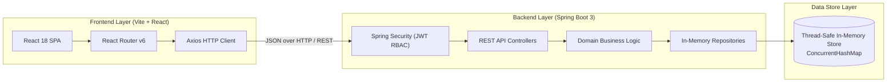

# Student Management System (SMS) — AI Debugging Training Lab

An enterprise-grade full-stack **Student Management System** designed as a realistic software engineering training benchmark for **AI-assisted debugging and code investigation**.

The application models a modern higher education portal with role-based access control, comprehensive student profile management, academic performance analytics, responsive UI dashboards, and robust RESTful services.

---

## 1. System Architecture



---

## 2. Technology Stack

### Backend
- **Language**: Java 21 LTS
- **Framework**: Spring Boot 3.3.4
- **Modules**:
  - `spring-boot-starter-web`: High-performance RESTful Web APIs
  - `spring-boot-starter-validation`: Bean Validation (Jakarta Validation / Hibernate Validator)
  - `spring-boot-starter-security`: Authentication, authorization, and stateless JWT filters
  - `jjwt` (Java JWT 0.12.6): HMAC-SHA signed JWT generation and validation
- **Build Tool**: Apache Maven 3.8+

### Frontend
- **Framework**: React 18
- **Bundler / Tooling**: Vite 5
- **Routing**: React Router DOM v6
- **Styling**: Tailwind CSS 3
- **Icons**: Lucide React
- **HTTP Client**: Axios

### Data Store
- **Zero SQL Database / Pure In-Memory**: Pure Java thread-safe in-memory store (`ConcurrentHashMap`). No MySQL, no PostgreSQL, no H2, no external database or instance needed! Seed data is populated automatically on startup.

---

## 3. Prerequisites & Environment Requirements

Ensure the following tools are installed on your machine:
- **Java**: OpenJDK 21 or higher (`java -version`)
- **Maven**: Version 3.8 or higher (`mvn -version`)
- **Node.js**: Version 18 or 20 LTS (`node -version`)
- **npm**: Version 9 or 10 (`npm -version`)

---

## 4. Quick Start: Running the Project

### Step 1: No Database Installation Needed
The application runs out-of-the-box with zero external database configuration. Realistic seed records (25+ students and staff accounts) are initialized automatically upon boot.

---

### Step 2: Backend Setup & Launch

1. Navigate to the backend directory:
   ```bash
   cd "project 1/backend"
   ```
2. Build and run the Spring Boot application:
   ```bash
   mvn spring-boot:run
   ```
3. The backend will start on **`http://localhost:8080`**.
4. Health check: open `http://localhost:8080/api/dashboard/stats` in your browser or curl.

---

### Step 3: Frontend Setup & Launch

1. Open a second terminal and navigate to the frontend folder:
   ```bash
   cd "project 1/frontend"
   ```
2. Install npm dependencies:
   ```bash
   npm install
   ```
3. Start the Vite development server:
   ```bash
   npm run dev
   ```
4. The web application will launch at **`http://localhost:5173`**.

---

## 5. Default Credentials

The database is pre-seeded with sample user accounts across two role tiers:

| Username | Password | Role | Description |
|---|---|---|---|
| `admin` | `Admin@123` | `ADMIN` | System administrator with full CRUD and deletion rights |
| `teacher` | `Teacher@123` | `TEACHER` | Academic faculty account with view, create, and update rights |
| `teacher2` | `Teacher@456` | `TEACHER` | Secondary academic faculty account |

*(Quick-fill chips are provided on the login screen for convenient role switching).*

---

## 6. REST API Reference

All protected endpoints require an `Authorization: Bearer <jwt_token>` header.

### Authentication Endpoints
| Method | Endpoint | Access | Description |
|---|---|---|---|
| `POST` | `/api/auth/login` | Public | Authenticates credentials and returns JWT token |
| `POST` | `/api/auth/logout` | Authenticated | Invalidates client session context |
| `GET` | `/api/auth/me` | Authenticated | Retrieves current logged-in user profile |

### Student Management Endpoints
| Method | Endpoint | Access | Description |
|---|---|---|---|
| `GET` | `/api/students` | Admin, Teacher | Retrieves list of all students |
| `GET` | `/api/students/{id}` | Admin, Teacher | Retrieves single student details by primary key ID |
| `POST` | `/api/students` | Admin, Teacher | Creates a new student record (Validates DTO) |
| `PUT` | `/api/students/{id}` | Admin, Teacher | Updates an existing student record |
| `DELETE` | `/api/students/{id}` | Admin Only | Permanently deletes a student record |
| `GET` | `/api/students/page` | Admin, Teacher | Paginated query (`?page=1&size=10&sortBy=id&sortDir=asc`) |
| `GET` | `/api/students/search` | Admin, Teacher | Search students by query & department |
| `GET` | `/api/students/filter` | Admin, Teacher | Filter students by department, year, passed status |
| `GET` | `/api/students/filter-by-department` | Admin, Teacher | Advanced department and academic year filter |

### Analytics & Dashboard Endpoints
| Method | Endpoint | Access | Description |
|---|---|---|---|
| `GET` | `/api/dashboard/stats` | Admin, Teacher | Summary KPIs: Total students, average marks, attendance, pass/fail counts, department breakdown |

---

## 7. Frontend Verification
 
To build the production frontend distribution:
```bash
cd "project 1/frontend"
npm run build
```

---

## 8. The AI Debugging Challenge

### Mission Briefing
Welcome to the AI Debugging Training Program! 

You are stepping into the role of a software engineer maintaining this Student Management System. Although the codebase builds cleanly without any syntax or compilation errors, **subtle logical, functional, API, database, security, and UI defects exist within the application**.

### Your Objectives
1. **Explore the Application**: Log in as both `admin` and `teacher`. Test standard workflows: create students, edit profiles, apply searches, paginate through records, filter by department, review the dashboard, and attempt deletions.
2. **Identify Defects**: Use disciplined testing and edge-case exploration to discover unexpected behaviors, data discrepancies, validation bypasses, or server crashes.
3. **Partner with AI Assistants Responsibly**: Consult AI tools (ChatGPT, Gemini, Claude, Copilot, or Antigravity) using the structured methodology detailed in [AI_DEBUGGING_GUIDE.md](file:///home/dell/project%201/AI_DEBUGGING_GUIDE.md). Do not simply ask AI to "fix everything"—formulate targeted, context-rich prompts.
4. **Document Your Findings**: Record each defect in [STUDENT_BUG_REPORT.md](file:///home/dell/project%201/STUDENT_BUG_REPORT.md), capturing reproduction steps, evidence, root cause analysis, prompt history, diffs, and verification steps.
5. **Verify and Protect**: Ensure every proposed fix is accompanied by manual or automated regression testing.
# project_1
